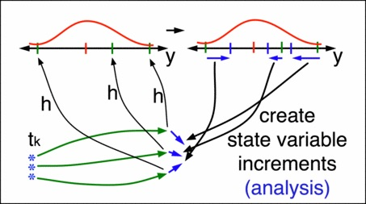

<!--
!   _________.   _________        __________________   _________
!  /   _____| __|______   \_____  |_____   \_   ___ \ /   _____/
!  \_____  | |__||     ___/\__  \ |       _/    \  \/ \_____  | 
!  |        \|  ||    |     / __ \|    |   \     \____/        \
!  |________/|__||____|    (____  /____|_  /\______  /_______  /
-->

This summer internship position will be exploring new diagnostic tools
for users to visualize time series information of 3D Spatial data using
Python. Currently all of are scripts are written in Matlab, and we would
are aiming to create a suite of diagnostic tools that are easy for users
to integrate into their own work flow, and make plots that are intuitive
and comprehensive.

The typical set-up is a "twin experiment", where you
* specify a
  * dynamic model* 
  * observational model*
* use these to generate a synthetic
  * "truth"
  * and observations thereof*
* assess how different DA methods perform in estimating the truth,
    given the above starred (*) items.

Installation
------------------------------------------------
Prerequisite: `python3.5+` with
`scipy`, `matplotlib`, `pandas`.
This is all comes with [anaconda](https://www.continuum.io/downloads)
by default.

For the tutorials, you will also need
`jupyter` and the `markdown` package.

It is also recommended to install `tqdm` (e.g. `pip install tqdm`).

Models
------------

Model       | Linear? | Phys.dim. | State len | # Lyap≥0 | Thanks to
----------- | ------- | --------- | --------- | -------- | ----------
<!--

Lin. Advect.| Yes     | 1D        | 1000 *    | 51       | Evensen/Raanes
Lorenz63    | No      | 0D        | 3         | 2        | Lorenz/Sakov
Lorenz84    | No      | 0D        | 3         | 2        | Lorenz/Raanes
Lorenz95    | No      | 1D        | 40 *      | 13       | Lorenz/Raanes
LorenzUV    | No      | 2x 1D     | 256 + 8 * | ≈60      | Lorenz/Raanes
MAOOAM      | No      | 2x 1D     | 36        | ?        | Vannitsem/Tondeur
Quasi-Geost | No      | 2D        | 129²≈17k  | ?        | Sakov

*: flexible; set as necessary

-->

Additional features
------------------------------------------------
Many
* Visualizations 
* Diagnostics
* Tools to manage and display experimental settings and stats

<!--

Also has:
* Live plotting with on/off toggle
* Confidence interval on times series (e.g. rmse) with
  * automatic correction for autocorrelation 
  * significant digits printing
* CovMat class (input flexibility/overloading, lazy eval) that facilitates
    the use of non-diagnoal covariance matrices (whether sparse or full)
* Intelligent defaults (e.g. plot duration estimated from autocorrelation,
    axis limits estimated from percentiles)
* Chronology/Ticker with consistency checks
* Gentle failure system to allow execution to continue if experiment fails.
* Progressbar
* Multivariate random variables: Gaussian, Student-t, Laplace, Uniform, ...,
    as well as support for custom sampling functions.
* X-platform random number generator (for debugging accross platforms)
* Parallelisation options
    * Forecast parallelisation is possible since
        the (user-implemented) model has access to the full ensemble
        (see `mods/QG/core.py`)
    * A light-weight alternative (see e.g. `mods/Lorenz95/core.py`):
        native numpy vectorization (again by having access to full ensemble).
    * (Independent) experiments can also run in parallel.
        Auto-config provided by `utils.py:parallelize()`.

-->

What it can't do
------------------------------------------------

<!--
* Do highly efficient DA on very big models (see discussion in introdution).
* Run different DA methods concurrently (i.e. step-by-step)
     allowing for live/online  (graphic or text) comparison.
* Time-dependent error coviariances and changes in lengths of state/obs
     (but f and h may otherwise depend on time).
* Non-uniform time sequences only partially supported.
-->

How to
------------------------------------------------

<!--
Alternative projects
------------------------------------------------
Sorted by approximate project size.
DAPPER may be situated somewhere in the middle.

* DART         (NCAR)
* SANGOMA      (Liege/CNRS/Nersc/Reading/Delft)
* Verdandi     (INRIA)
* PDAF         (Nerger)
* ERT*         (Statoil)
* OpenDA       (TU Delft)
* MIKE         (DHI)
* PyOSSE       (Edinburgh)
* FilterPy     (R. Labbe)
* DASoftware   (Yue Li, Stanford)
* PyIT         (CIPR)
* OAK          (Liège)
* Siroco       (OMP)
* Datum*       (Raanes)
* EnKF-Matlab* (Sakov)
* IEnKS code*  (Bocquet)
* pyda         (Hickman)

-->

TODO
------------------------------------------------
* Reorganize file structure
* Turn into package?
* Simplify time management?
* Use pandas for stats time series?
* Complete QG

References
------------------------------------------------
<!--
- Sakov (2008)   : Sakov and Oke. "A deterministic formulation of the ensemble Kalman filter: an alternative to ensemble square root filters".  
- Anderson (2010): "A Non-Gaussian Ensemble Filter Update for Data Assimilation"
- Bocquet (2010) : Bocquet, Pires, and Wu. "Beyond Gaussian statistical modeling in geophysical data assimilation".  
- Bocquet (2011) : Bocquet. "Ensemble Kalman filtering without the intrinsic need for inflation,".  
- Sakov (2012)   : Sakov, Oliver, and Bertino. "An iterative EnKF for strongly nonlinear systems".  
- Bocquet (2012) : Bocquet and Sakov. "Combining inflation-free and iterative ensemble Kalman filters for strongly nonlinear systems".  
- Bocquet (2014) : Bocquet and Sakov. "An iterative ensemble Kalman smoother".  
- Bocquet (2015) : Bocquet, Raanes, and Hannart. "Expanding the validity of the ensemble Kalman filter without the intrinsic need for inflation".  
- Tödter (2015)  : Tödter and Ahrens. "A second-order exact ensemble square root filter for nonlinear data assimilation".  
- Raanes (2015)  : Raanes, Carrassi, and Bertino. "Extending the square root method to account for model noise in the ensemble Kalman filter".  
- Raanes (2016a) : Raanes. "On the ensemble Rauch-Tung-Striebel smoother and its equivalence to the ensemble Kalman smoother".  
- Raanes (2016b) : Raanes. "Improvements to Ensemble Methods for Data Assimilation in the Geosciences".  
- Wiljes (2017)  : Aceved, Wilje and Reich. "Second-order accurate ensemble transform particle filters".  

Further references are provided in the algorithm codes.
-->

Contact
------------------------------------------------
hendric@ucar.edu

Licence
------------------------------------------------

<!--
"Outreach"
---------------
* http://stackoverflow.com/a/38191145/38281
* http://stackoverflow.com/a/37861878/38281
* http://stackoverflow.com/questions/43453707
-->

